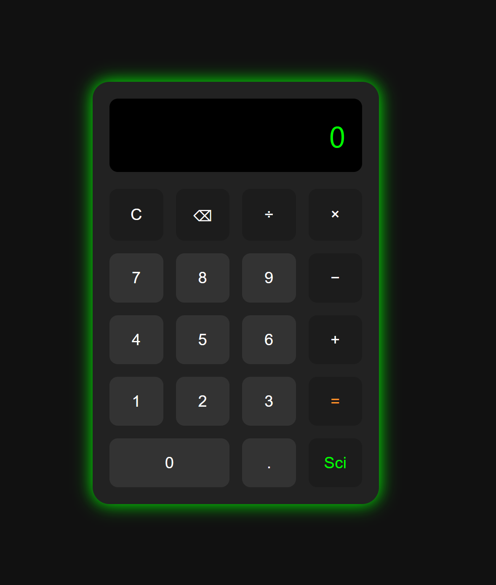

# Calculator App

A stylish calculator with basic and scientific modes built using:
- HTML
- CSS
- JavaScript

## Features
- Toggle between basic and scientific mode
- Handles sin, cos, log, sqrt, and power functions
- Responsive UI and clean design

## Live Demo
👉 [View it here](https://yourusername.github.io/calculator-app/)

## Screenshot

(sci.png)

---
