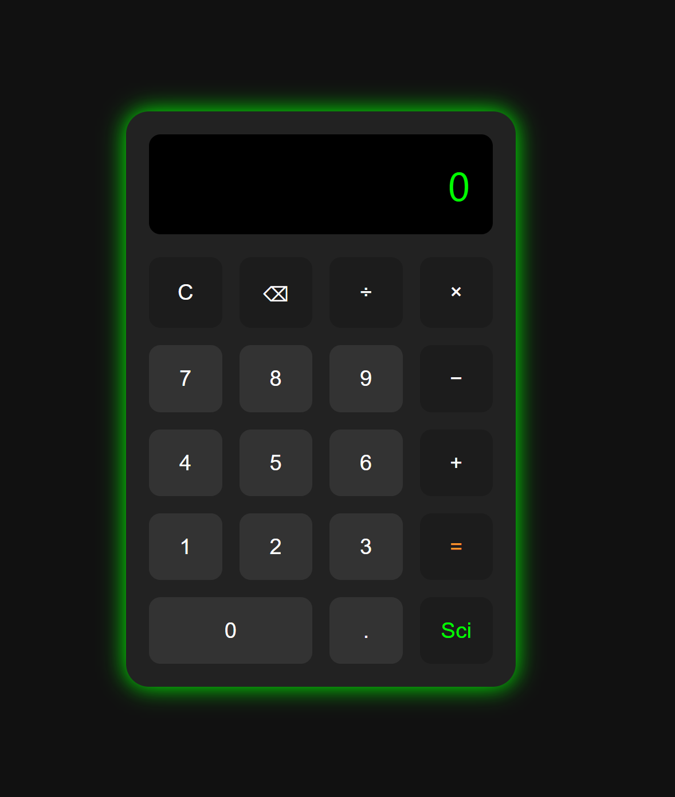
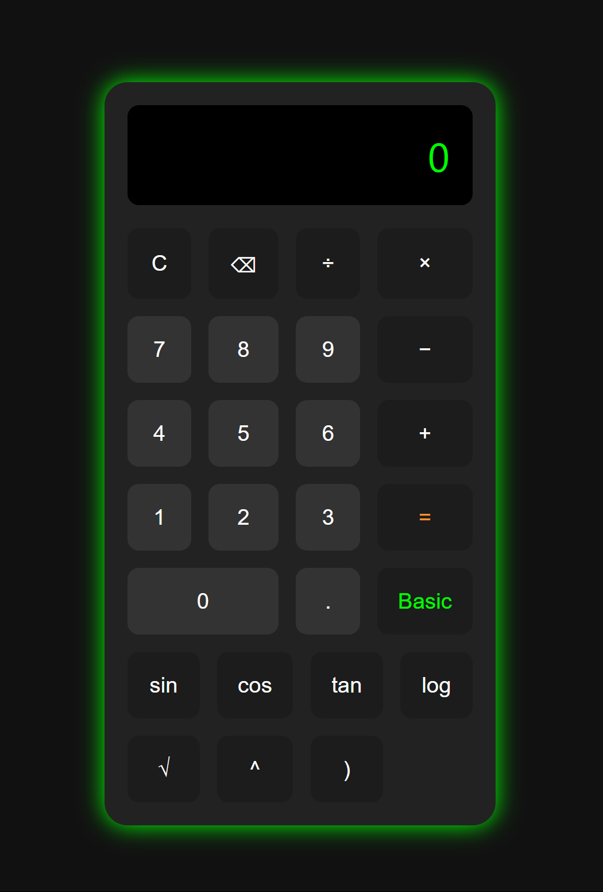

# Calculator App

A responsive calculator with both **basic** and **scientific modes**, built using **HTML**, **CSS**, and **JavaScript**.

---

## Features

- Basic arithmetic operations: `+`, `-`, `×`, `÷`
- Scientific functions: `sin`, `cos`, `tan`, `log`, `√`, `^`
- Toggle between Basic and Scientific modes
- Clean UI with hover effects and modern button design
- Fully responsive (works on mobile and desktop)

---

## Screenshot
<table>
  <ul>

  </ul>
</table>

---

## How to Use

1. Clone or download this repository
2. Open `index.html` in your browser
3. Start calculating!

---

## Contributing

Want to improve the calculator or add new features like themes or voice input?  
Feel free to fork the project and submit a pull request.

---

## Author

Muhammad Shayan  
💼 [LinkedIn](https://www.linkedin.com/in/muhammad-shayan-90aa6b245/)  
📦 [GitHub](https://github.com/MShayan34)

---

## License

This project is open-source and available under the [MIT License](LICENSE).
